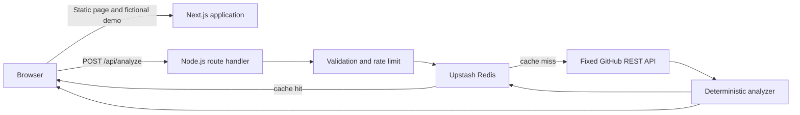

# Architecture

Codebase Time Machine is a bounded synchronous Next.js application designed for Vercel. It favors a small, auditable request path over repository cloning, durable jobs, or a database.

## System overview



The static fictional demo is generated from checked-in data and does not call GitHub. Live analysis exists only behind `POST /api/analyze`.

## Runtime components

### Web application

The Next.js App Router renders the product UI. Static content and the demo should remain usable when GitHub or Upstash is unavailable. Security headers are configured centrally in `next.config.ts`.

### Analyze route

`app/api/analyze/route.ts` runs in the Node.js runtime, is always dynamic, and declares a 20-second maximum duration. It performs one complete analysis synchronously:

1. Reject bodies larger than 1 KiB.
2. Require `application/json`.
3. Apply the analysis rate limit.
4. Parse a strict `{ repository: string }` request with Zod.
5. Accept only `owner/repository` or a clean HTTPS `github.com/owner/repository` URL.
6. Look up a 15-minute analysis cache by normalized owner and repository.
7. On a miss, apply a per-repository budget and acquire a short distributed lock.
8. Recheck the cache, apply the global upstream budget, then retrieve bounded data from GitHub.
9. Run the pure analyzer, validate and size-cap the result, write the cache on a best-effort basis, and return JSON.

Errors use stable machine-readable codes. Responses are `no-store` at the browser/CDN boundary because the shared application cache is controlled explicitly in Upstash.

### GitHub adapter

The server constructs every upstream URL from validated owner, repository, and tree-SHA segments against the constant origin `https://api.github.com`. User input never selects the host, protocol, port, query, or arbitrary path.

One live analysis uses only these endpoint shapes:

```text
GET /repos/{owner}/{repository}
GET /repos/{owner}/{repository}/commits?per_page=60
GET /repos/{owner}/{repository}/git/trees/{treeSha}?recursive=1
```

The repository metadata is validated before commits are requested, so an accidentally overprivileged token cannot fetch private commit history. The tree endpoint is called for at most five unique selected checkpoints. Tree payloads are fetched sequentially to avoid concurrent multi-megabyte buffering. Every response is streamed under a byte ceiling, retains an eight-second abort timeout through body consumption, and is schema-validated before use. A route-wide absolute 18-second work deadline starts before network-backed guards and keeps the complete sequence inside the Vercel function envelope. The 25-second lock TTL outlives that work budget so a second function cannot begin duplicate work during validation or cache cleanup.

The optional `GITHUB_TOKEN` remains server-side. Without it, GitHub applies a substantially smaller unauthenticated quota.

### Deterministic analyzer

`lib/analyzer.ts` is a pure transformation over already fetched inputs. It:

- Sorts commits and trees by date, then SHA
- Selects at most five evenly spaced checkpoints from at most 60 recent commits
- Keeps blob entries, normalizes paths, and sorts paths deterministically
- Displays at most 1,500 files per snapshot
- Calculates file-presence changes across adjacent checkpoints
- Aggregates sampled contributor counts with deterministic tie-breaking
- Produces structural milestones from net file-count and new top-level-directory evidence

Given identical validated inputs, analyzer output is stable. The live GitHub repository can change between separate uncached requests, so the complete network operation is not a historical snapshot transaction.

## Data and cache boundaries

There is no application database in the MVP. Upstash Redis stores:

- Distributed sliding-window rate-limit counters
- Per-repository and global GitHub-work budgets
- Short single-flight locks for uncached repository analyses
- Completed analysis JSON for 15 minutes under `ctm:analysis:v1:{lowercase-owner}/{lowercase-repository}`

The cache is repository-keyed, not commit-keyed. This is intentionally simple, but it means pushes may take up to 15 minutes to appear. Cache hits still consume an analysis attempt. A transient cache write failure does not discard a successful analysis response.

No source blobs, repository archives, OAuth tokens, raw IP addresses, durable user profiles, or private-repository content are stored.

## Production controls

### Rate limiting

The analysis endpoint allows five attempts per pseudonymous client key in a sliding 15-minute window. The key is an HMAC of the client address. Vercel's forwarded-client header is preferred; the conventional forwarded header exists as a local/proxy fallback. Cache misses then pass a per-repository budget before lock acquisition; only the lock owner consumes the small global GitHub-work budget. This ordering prevents concurrent duplicate work from exhausting shared upstream capacity.

Upstash is required in production. If the distributed limiter cannot be created or reached, the costly endpoint returns `503` rather than running without protection. A process-local limiter is available only outside production and resets whenever the process restarts.

Rate-limit responses include `RateLimit-Limit`, `RateLimit-Remaining`, `RateLimit-Reset`, and, when blocked, `Retry-After`.

### Input and upstream validation

- Request object rejects unknown fields and limits repository input to 200 characters.
- Owner and repository segments allow only a conservative character set and a 100-character per-segment maximum.
- URL credentials, query strings, fragments, non-HTTPS protocols, non-GitHub hosts, and extra path segments are rejected.
- GitHub JSON is parsed against explicit Zod schemas before analysis.
- Repository code is never downloaded or executed.

### Response and browser security

The application emits a restrictive Content Security Policy plus referrer, MIME-sniffing, framing, permissions, opener, and resource-policy headers. GitHub-controlled text is rendered as text by React; it must never be inserted as raw HTML.

Secrets must not use a `NEXT_PUBLIC_` prefix. Canonical metadata must derive from trusted `SITE_URL`, not the request `Host` header.

## Coverage contract

Coverage is part of the public result schema, not an implementation footnote.

| Boundary               |        Current maximum | Disclosure behavior                                 |
| ---------------------- | ---------------------: | --------------------------------------------------- |
| Commit history         | 60 most recent commits | Mark partial when the response reaches 60           |
| Structural checkpoints |                5 trees | Return actual checkpoint count                      |
| Displayed files        |         1,500 per tree | Mark snapshot and analysis partial when exceeded    |
| GitHub recursive tree  |      GitHub-controlled | Preserve GitHub's `truncated` flag and mark partial |

`filesAtHead` uses GitHub's blob count for the sampled head tree, while visualization and displayed byte totals cover only the capped normalized files. Contributor and milestone claims apply only to the sampled data.

## Serverless fit

The design assumes:

- Instances are ephemeral and can start cold.
- In-memory state is not shared and is not a production correctness mechanism.
- Filesystem writes are unnecessary.
- Each live analysis must finish within one function invocation.
- There is no promise that work continues after a client-visible timeout.

This is why request work, GitHub calls, and visualization size are bounded. If real usage demonstrates that synchronous analysis is insufficient, a durable job design should be introduced as a separate, measured architecture change—not simulated with unawaited serverless work.

## Failure behavior

| Condition                                 | Behavior                                        |
| ----------------------------------------- | ----------------------------------------------- |
| Invalid content type or JSON              | `415` or `400` with a stable error code         |
| Invalid/non-GitHub repository             | `400`; no GitHub request                        |
| Missing or unreachable production limiter | `503`; analysis fails closed                    |
| Client rate limited                       | `429` with retry timing                         |
| Missing/private repository                | `404` or `403`-style application response       |
| GitHub quota exhausted                    | `503` with upstream retry timing when available |
| GitHub timeout/unavailability             | `504` or `502`                                  |
| Truncated tree or history cap             | Successful partial result with explicit reasons |
| Unknown validation/analysis failure       | Sanitized `502`; no upstream payload leak       |

## Deliberate non-goals

- Full Git history reconstruction
- Private repository authentication
- Cloning or executing repository code
- AST, dependency, pull-request, or issue analysis
- Arbitrary Git providers
- AI-generated architectural claims
- User accounts, teams, or persistent projects
- Durable queues and background workflows

These can be reconsidered only with concrete user evidence, a revised threat model, and corresponding tests.
